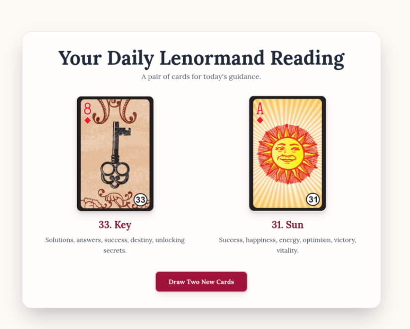

# 🌸 Daily Lenormand Card Reader

This is a simple web-based **Lenormand card reader** that draws **two daily cards** for guidance.  
The cards are displayed with their names, images, and meanings.

✨ Built with:
- **HTML5**  
- **JavaScript** (for card drawing logic)  
- **TailwindCSS** (for styling)  

---

## 📖 Features
- Displays **two random Lenormand cards** for the day.  
- Each card shows:
  - Image  
  - Number and Name  
  - Meaning  
- **Daily draw** (deterministic, based on today’s date).  
- **New random draw** button for exploring different card pairs.  

---

## 🗂️ Project Structure
lenormand-reading/
├── Lenormand_todays_card.html # Main HTML file
├── cards/ # Folder with all card images
│ ├── card1.png
│ ├── card2.png
│ ├── ...
│ └── card36.png
├── screenshot.png # Screenshot for README preview

---

## 🔮 Preview

Here’s what the Daily Lenormand Card Reader looks like:

---

## 🚀 How to Use
1. Clone or download this repository.  
2. Make sure you have all **36 card images** inside the `cards/` folder.  
3. Open `Lenormand_todays_card.html` in your browser.  

👉 Or visit the **live site on GitHub Pages**:  
[https://esotherica25.github.io/lenormand-reading/](https://esotherica25.github.io/lenormand-reading/)

---

## 🎴 The Deck
This project uses the **36-card Petit Lenormand deck**, including:
- Rider  
- Clover  
- Ship  
- House  
- … up to Cross  

Each card has its traditional meaning embedded in the script.

---

## 🌟 Credits
Created with ❤️ for personal spiritual guidance.  
Card meanings are based on traditional Lenormand interpretations.  

---

## 📜 License
This project is open-source under the **MIT License**.  
You are free to use, modify, and share it.
